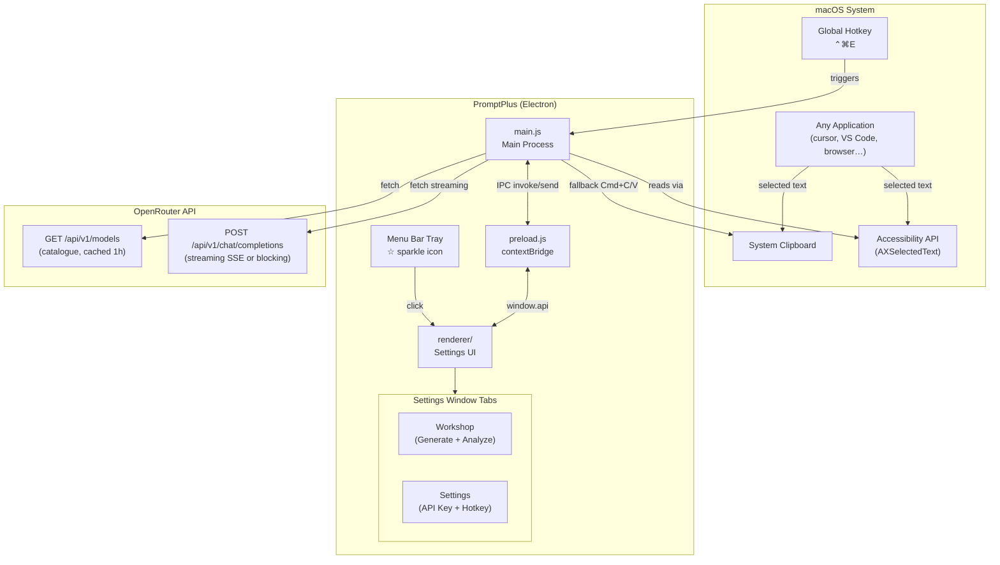
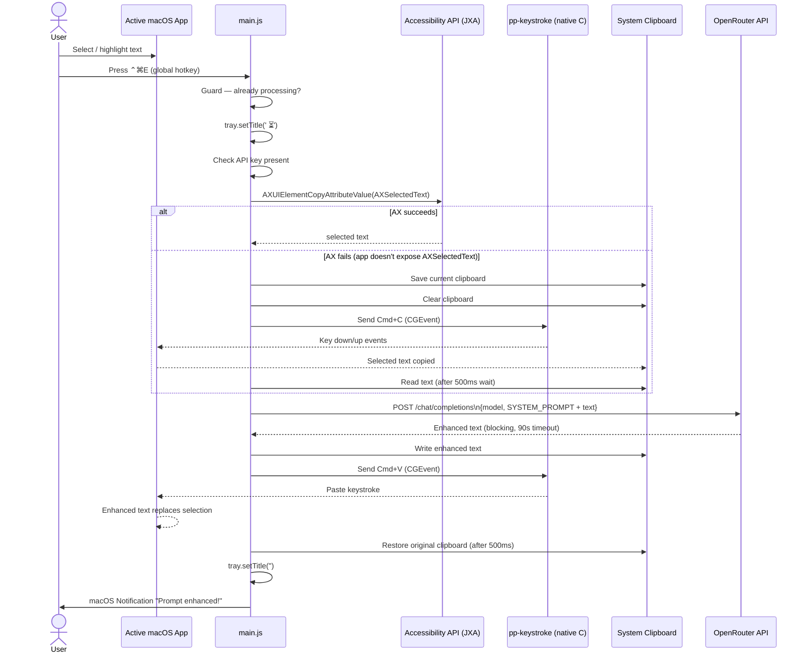
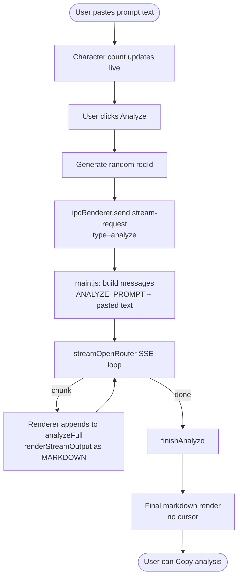
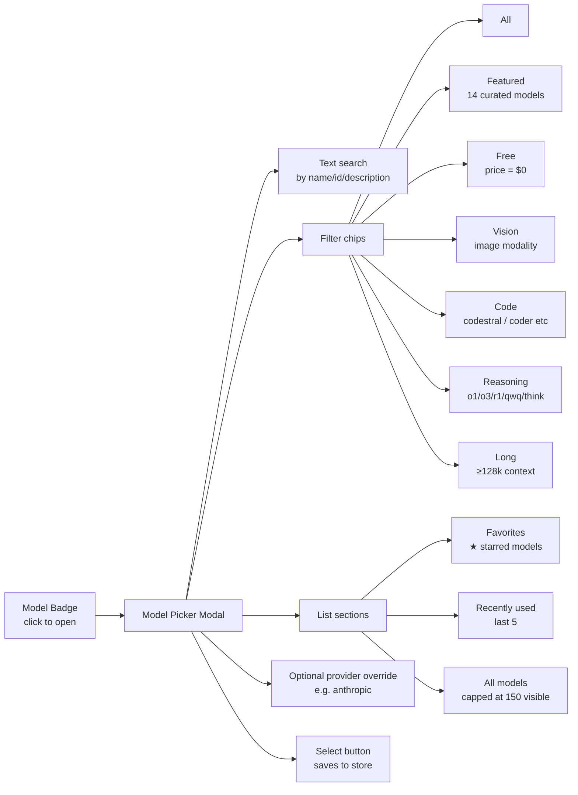
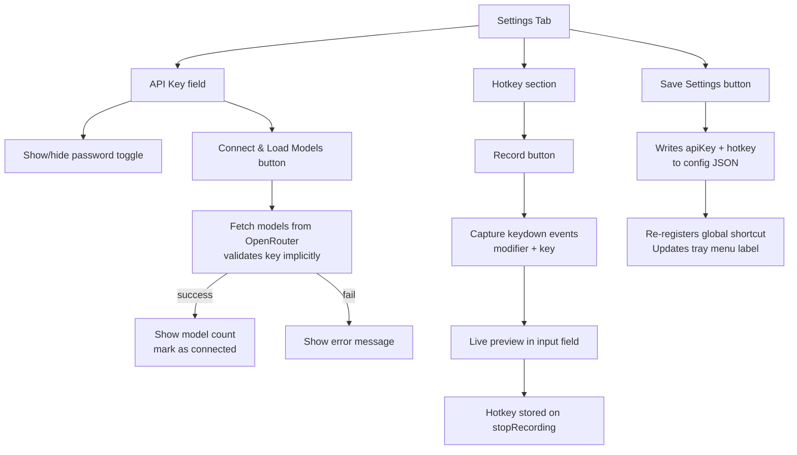
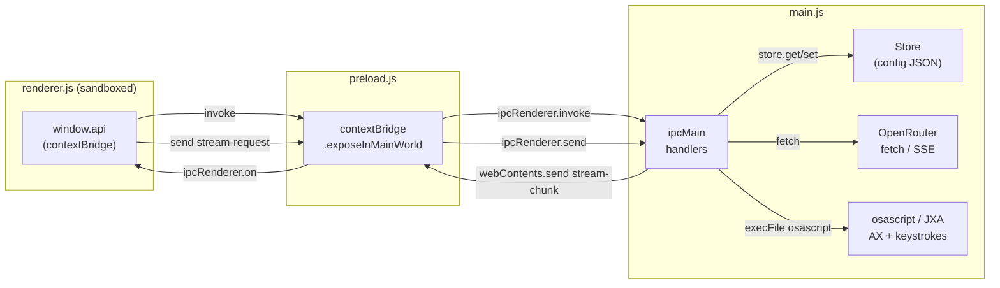
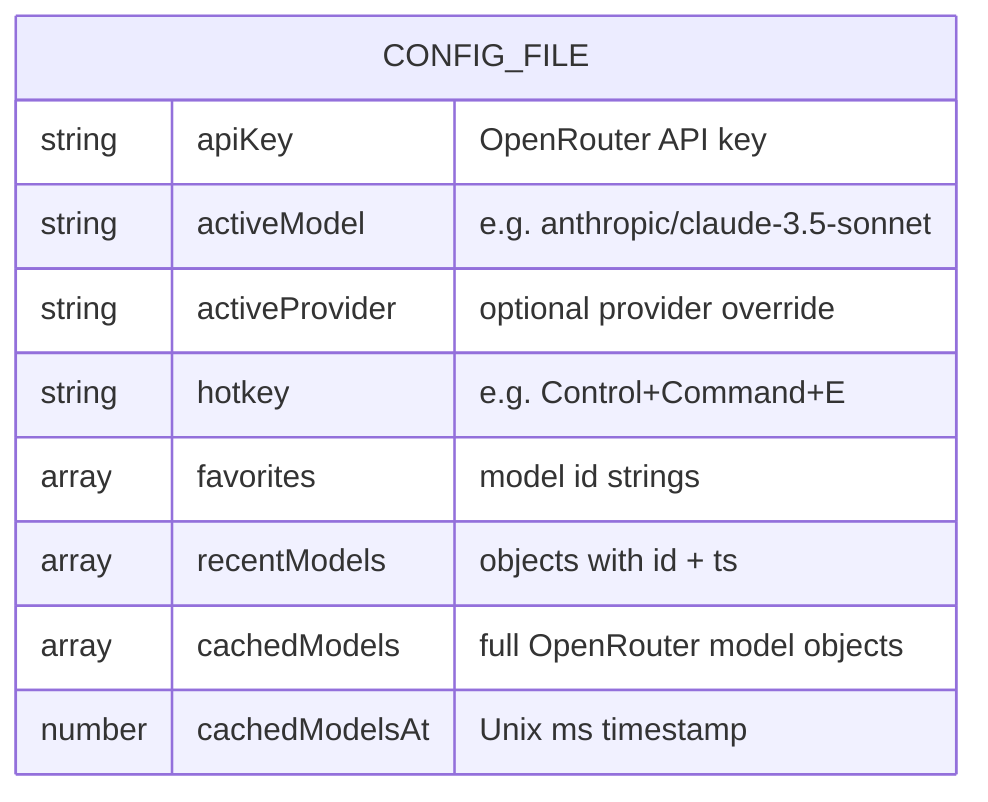
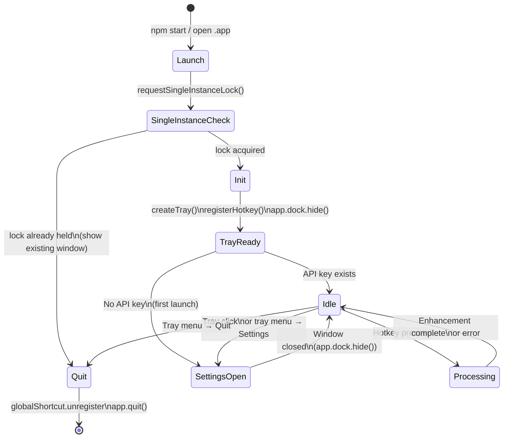

# PromptPlus — Comprehensive Feature Guide

## What Is PromptPlus?

PromptPlus is a macOS menu-bar app that acts as an AI co-pilot for anyone who writes prompts. It sits silently in the system tray and provides three distinct workflows: instantly rewriting highlighted text in any app via a global hotkey, generating new prompt templates from scratch, and analysing existing prompts for quality feedback. Everything routes through [OpenRouter](https://openrouter.ai), giving access to every major model (Claude, GPT-4o, Gemini, Llama, DeepSeek, and hundreds more) from a single API key.

---

## System Overview



---

## Feature 1 — Global Hotkey Enhancement

The core feature. Select any text in any macOS application, press the hotkey, and the text is replaced in-place with an AI-enhanced version.

### How It Works



### Key Details

| Aspect | Detail |
|--------|--------|
| Default hotkey | `⌃⌘E` (Control + Command + E) |
| Text extraction method 1 | `AXSelectedText` via JXA/osascript (no clipboard side-effect) |
| Text extraction method 2 | Simulate `Cmd+C`, read clipboard (fallback for apps that don't expose AX) |
| Clipboard safety | Original clipboard saved before and restored after |
| Keystroke method 1 | Native compiled C binary (`pp-keystroke`) using CoreGraphics `CGEventPost` |
| Keystroke method 2 | JXA CGEvent fallback if the C helper isn't compiled yet |
| Native helper | Compiled once on first use, cached in `~/Library/Application Support/promptplus/pp-keystroke` |
| API call type | Non-streaming (waits for full response before pasting) |
| Timeout | 90 seconds |
| Guard | Single-flight (`isProcessing` flag) — hotkey ignored while a request is in flight |

### SYSTEM_PROMPT Strategy

The enhance system prompt instructs the model to:
- Identify core intent
- Apply structure (Goal / Context / Instructions / Output Format / Examples)
- Sharpen language (replace vague with specific)
- Scale to complexity (light touch for simple questions, full restructure for complex tasks)
- Return **only** the enhanced prompt — no commentary, no wrappers

---

## Feature 2 — Workshop: Generate Tab

Type a description of what you want a prompt to do; the model streams back a complete, production-ready prompt template.

### Generate Flow

```mermaid
flowchart TD
    A([User types task description]) --> B{Quick-task chip\nor manual input?}
    B -->|chip clicked| C[Pre-fill input field]
    B -->|typed manually| D[Input ready]
    C --> D
    D --> E{Thinking mode\ntoggle on?}
    E -->|yes| F[Append chain-of-thought\nhint to input]
    E -->|no| G[Input unchanged]
    F --> G
    G --> H[Generate random reqId]
    H --> I[ipcRenderer.send stream-request\ntype=generate]
    I --> J[main.js: build messages\nGENERATE_PROMPT + task]
    J --> K[streamOpenRouter SSE loop]
    K -->|chunk| L[ipcMain sends stream-chunk to renderer]
    L --> M[Renderer appends to generateFull\nrenderStreamOutput as plain text]
    M --> K
    K -->|done| N[ipcMain sends stream-done]
    N --> O[finishGenerate]
    O --> P{Any {{VARIABLES}}\nin output?}
    P -->|yes| Q[Show variable tags panel]
    P -->|no| R[Hide variable panel]
    Q --> S([User can Copy or Refine])
    R --> S
    S -->|Refine clicked| T[Move output to Analyze tab\nauto-switch mode]
```

### Features Within Generate

- **Quick-task chips** — one-click starters like "Write a code review prompt", "Summarise a document", etc.
- **Thinking mode toggle** — appends a chain-of-thought instruction hint, designed for `o1`/`o3`/reasoning models
- **Variable detection** — after generation, any `{{VARIABLE_NAME}}` placeholders are extracted and shown as tags
- **Streaming output** — text appears token-by-token with a blinking cursor
- **Stop button** — aborts the in-flight stream mid-generation
- **Refine shortcut** — one click sends the generated prompt straight to the Analyze tab

---

## Feature 3 — Workshop: Analyze Tab

Paste any existing prompt and get structured AI feedback: assessment, strengths, key issues, specific recommendations, context gaps, and an optional rewritten version.

### Analyze Flow



### ANALYZE_PROMPT Output Structure

The prompt instructs the model to return feedback in this exact XML-tagged structure, rendered as markdown in the UI:

```
<feedback>
  Overall Assessment
  Strengths
  Key Issues (ordered by importance)
  Specific Recommendations (numbered, with WHY)
  Context Gaps
  Enhanced Version (optional, if significant revision needed)
</feedback>
```

---

## Feature 4 — Model Picker

A full-featured modal for browsing and selecting from the entire OpenRouter model catalogue.



### Model List Details

Each model row shows:
- Display name + provider org
- Tags: `free` / `vision` / `reasoning` / `code`
- Context window (e.g. `200k`)
- Price per 1M tokens input/output (or `free`)
- Star button to toggle favourites

**Catalogue source:** `GET https://openrouter.ai/api/v1/models`
**Cache TTL:** 1 hour (persisted in config file)
**Refresh:** Manual via the refresh button in the settings header

---

## Feature 5 — Settings



### Hotkey Recording Mechanics

1. Clicking **Record** calls `ipcMain start-recording`, which **unregisters only the current hotkey** (never `unregisterAll()` — to avoid conflicting with apps like Alfred or Whispr)
2. The renderer captures `keydown` events directly
3. Any combination of `Control / Command / Alt / Shift` + a non-modifier key is valid
4. On confirmation, `ipcMain stop-recording` re-registers the new hotkey and updates the tray context menu label

---

## IPC Architecture



**Invoke (promise-based):** `get-settings`, `save-settings`, `get-models`, `set-active-model`, `toggle-favorite`, `start-recording`, `stop-recording`

**Fire-and-forget + event callbacks (streaming):** `stream-request` → replies via `stream-chunk` / `stream-done` / `stream-error` events; `stream-abort` cancels in-flight request

---

## Persistence & Configuration



**Location:** `~/Library/Application Support/promptplus/promptplus-config.json`

**Debug log:** `~/Library/Application Support/promptplus/promptplus-debug.log`
- All log levels in dev (`npm start`)
- WARN + ERROR only in packaged builds

---

## Application Lifecycle



---

## Current Capabilities & Known Constraints

### What Works
| Capability | Status |
|------------|--------|
| Global hotkey enhancement (in-place text replacement) | Fully working |
| AXSelectedText extraction (no clipboard side-effect) | Working where app supports it |
| Cmd+C clipboard fallback | Working with Accessibility permission |
| Streaming Generate + Analyze in UI | Fully working |
| Model picker with search, filters, favourites, recents | Fully working |
| OpenRouter model catalogue (any model, 300+) | Fully working, 1h cache |
| Thinking mode hint for reasoning models | Working (appends instruction) |
| Variable extraction (`{{VAR}}`) from generated prompts | Working |
| Refine shortcut (Generate → Analyze) | Working |
| Custom hotkey recording | Working |
| Persistent settings (API key, model, hotkey) | Working |
| macOS dark mode, hiddenInset title bar | Working |

### Requirements & Constraints
| Item | Detail |
|------|--------|
| Platform | macOS only (Ventura 13+ tested) |
| Permission | Accessibility must be granted in System Settings |
| API | OpenRouter key required (not OpenAI directly) |
| Architecture | Universal binary (Apple Silicon + Intel) |
| No Dock icon | Hides when settings window is closed |
| Single instance | Second launch focuses existing window |
| No test suite | No automated tests exist |
| No lint | No ESLint or Prettier configuration |
| Hotkey conflict avoidance | Only unregisters its own hotkey, never `unregisterAll()` |
| Keystroke delivery | Native C helper compiled on first use; JXA fallback if unavailable |
| Model cache TTL | 1 hour (hardcoded) |
| DevTools | Only available in dev mode (`⌘⌥I` when settings window focused) |
| Model list cap | UI renders max 150 rows before "refine your search" prompt |
