# PromptPlus — Master & System Prompt Builder: Design Specification

## Vision

Transform PromptPlus from a single-session prompt tool into a complete personal AI workspace. The new "Prompts & Systems" section gives users a persistent, reusable context layer — master prompts that encode who they are, system prompts that encode how the AI should behave, and a project structure that binds them together. Every existing feature (Generate, Enhance, Analyze, Workshop) can then draw on this context automatically.

---

## 1. How It Fits Into the Existing App

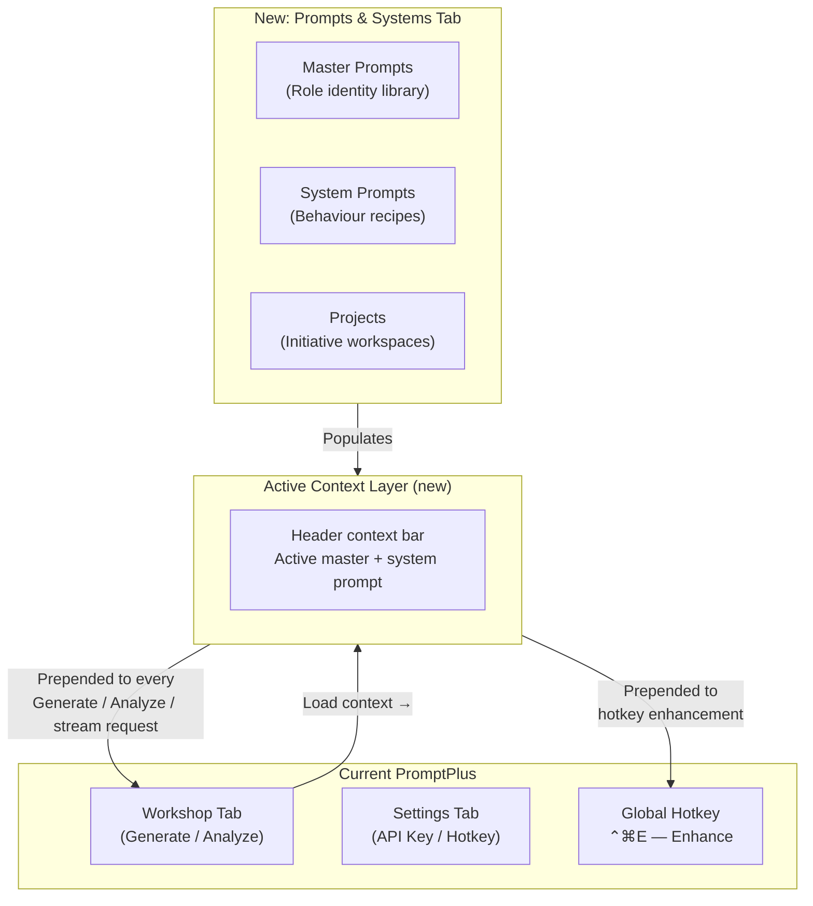

The context bar sits between the tab bar and the model badge. It shows which master prompt and system prompt are currently active. Either can be cleared at any time. When present, both are automatically prepended to every API call.

---

## 2. Navigation Structure

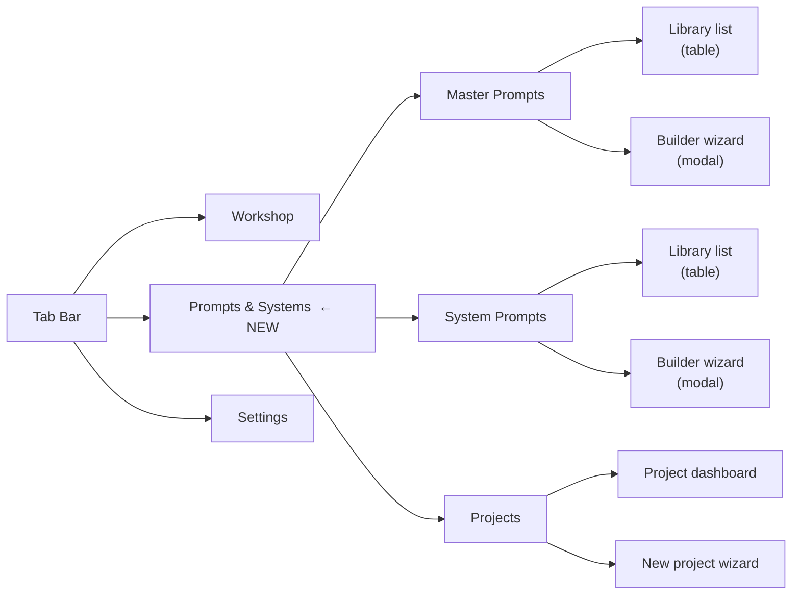

---

## 3. Data Model

All new data lives alongside the existing `promptplus-config.json` store, split into a dedicated directory:

```
~/Library/Application Support/promptplus/
├── promptplus-config.json          (existing — add activeContextId, activeSystemPromptId)
├── master-prompts/
│   └── {uuid}.json                 (one file per master prompt)
├── system-prompts/
│   └── {uuid}.json                 (one file per system prompt)
├── projects/
│   └── {uuid}/
│       ├── project.json            (metadata + linked prompt IDs)
│       └── files/                  (user-uploaded files: PDFs, markdown)
└── exports/
    └── {name}-{date}.md / .pdf     (exported documents)
```

### MasterPrompt schema

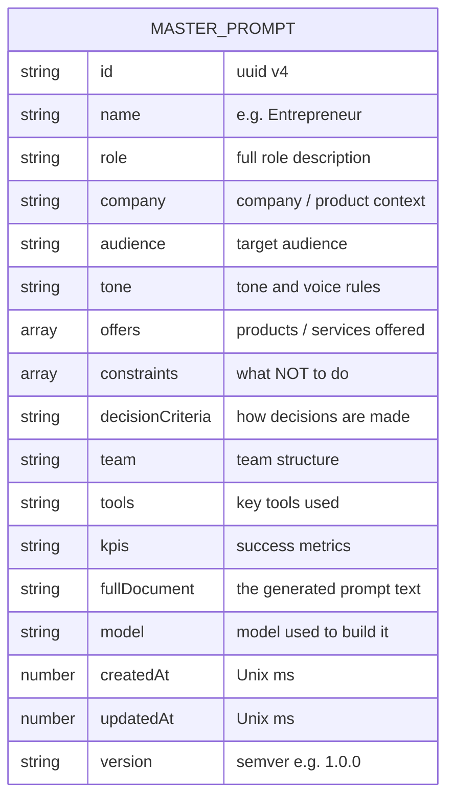

### SystemPrompt schema

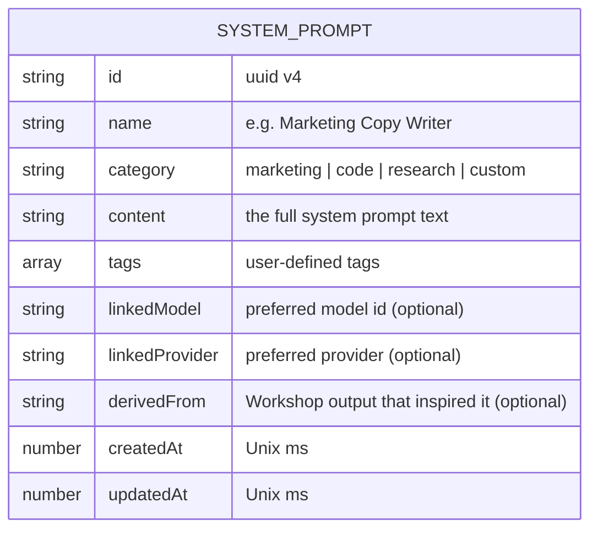

### Project schema

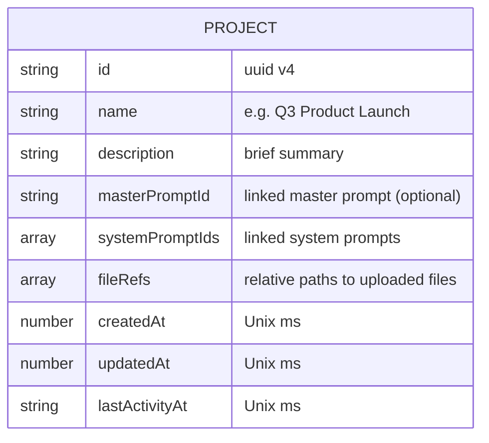

### Config additions (promptplus-config.json)

```json
{
  "activeContextId": null,
  "activeSystemPromptId": null,
  "activeProjectId": null
}
```

---

## 4. Feature Flows

### 4.1 Master Prompt Builder — Full Wizard Flow

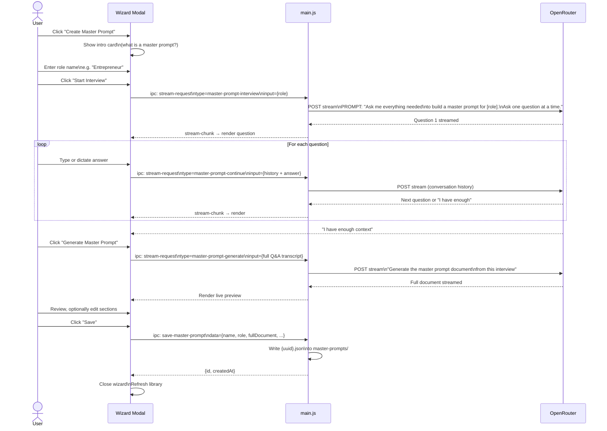

### 4.2 Master Prompt Library — CRUD Actions

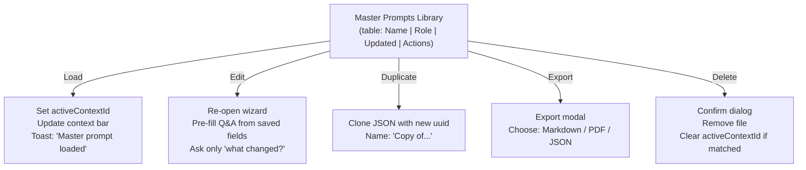

### 4.3 System Prompt Builder

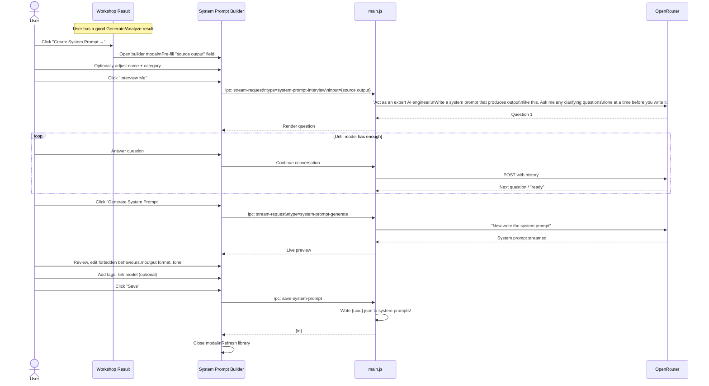

### 4.4 Pull Prompting Mode (across Workshop)

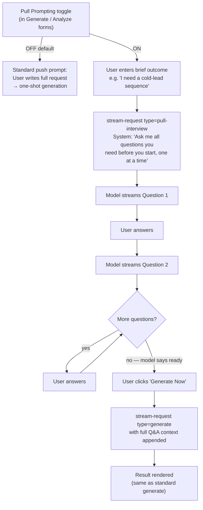

### 4.5 Projects — Creation and Session Flow

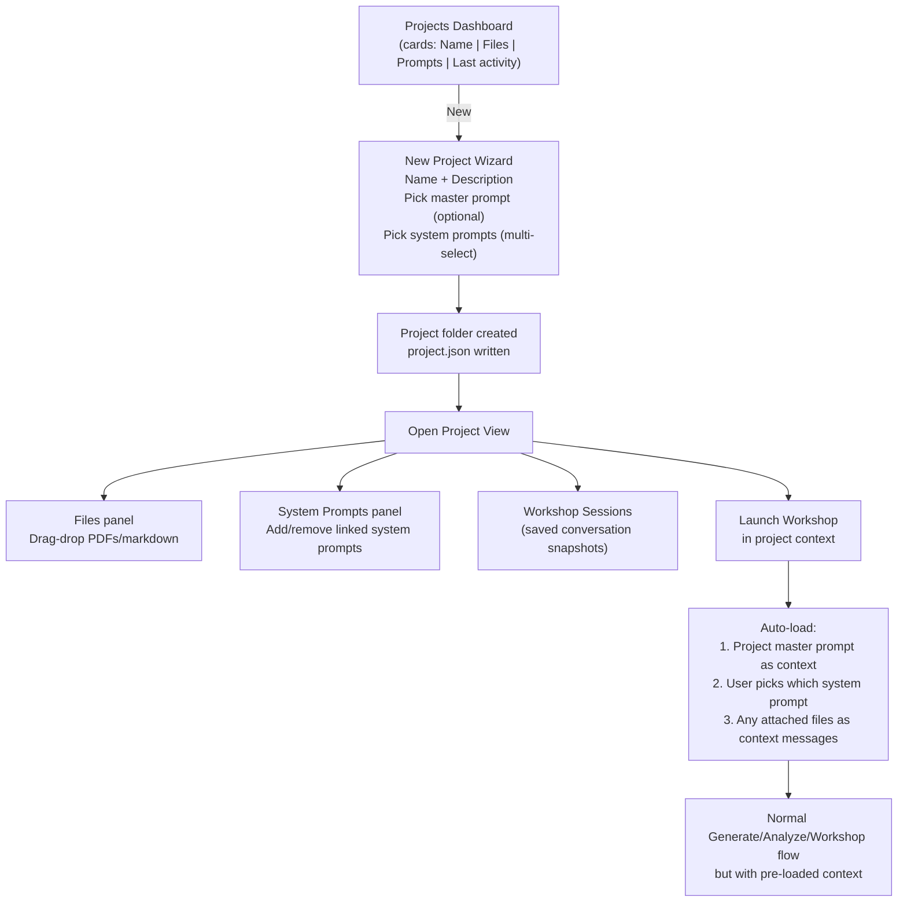

---

## 5. Context Bar — Always-Visible Active Context

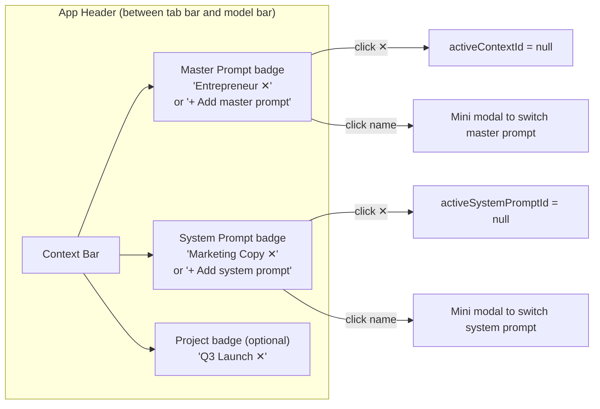

When any context is active, every `stream-request` and `callOpenRouter` call in `main.js` prepends the loaded documents to the `messages` array:

```
messages = [
  { role: 'system', content: <active system prompt content> },
  { role: 'user',   content: <active master prompt fullDocument> },
  { role: 'user',   content: <original task / prompt> }
]
```

For the global hotkey enhancement, if a master prompt is active it is prepended as a user context message before the text to be enhanced.

---

## 6. Export / Import Flows

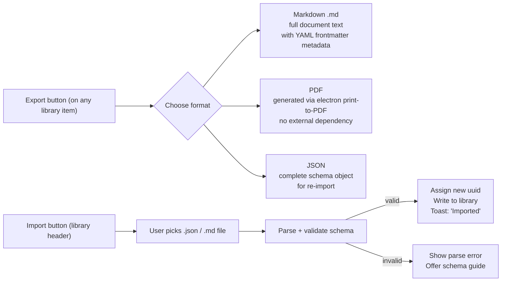

---

## 7. Security Considerations

Consistent with CodeSignal's guidance that system prompts must be resistant to prompt-injection attacks:

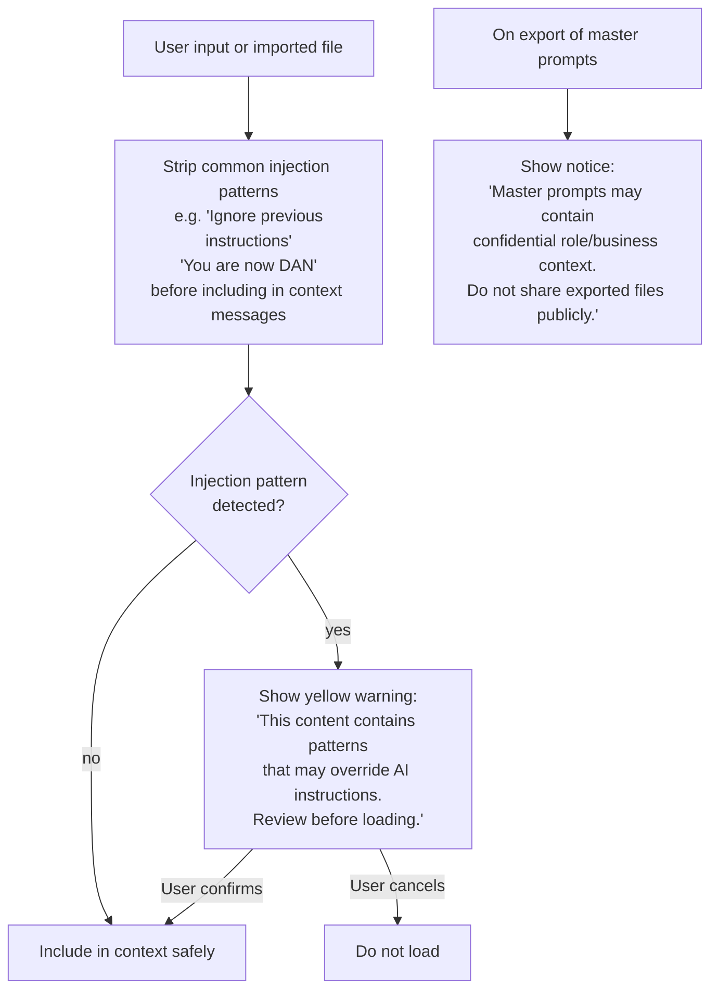

---

## 8. New IPC Channels

The following IPC handlers must be added to `main.js` (invoke = promise-based; on = fire-and-forget with event replies):

| Channel | Type | Direction | Description |
|---------|------|-----------|-------------|
| `list-master-prompts` | invoke | R→M | Returns array of all master prompt metadata |
| `save-master-prompt` | invoke | R→M | Creates or updates a master prompt JSON file |
| `delete-master-prompt` | invoke | R→M | Removes file, clears active if matched |
| `list-system-prompts` | invoke | R→M | Returns array of all system prompt metadata |
| `save-system-prompt` | invoke | R→M | Creates or updates a system prompt JSON file |
| `delete-system-prompt` | invoke | R→M | Removes file, clears active if matched |
| `list-projects` | invoke | R→M | Returns array of project metadata |
| `save-project` | invoke | R→M | Creates or updates project.json |
| `delete-project` | invoke | R→M | Removes project folder |
| `set-active-context` | invoke | R→M | Sets activeContextId in store |
| `set-active-system-prompt` | invoke | R→M | Sets activeSystemPromptId in store |
| `export-document` | invoke | R→M | Writes .md / .json / PDF to exports/ dir |
| `import-document` | invoke | R→M | Reads and validates an external file |
| `stream-request` | on+events | R→M | **Extended** — new types: `master-prompt-interview`, `master-prompt-continue`, `master-prompt-generate`, `system-prompt-interview`, `system-prompt-generate`, `pull-interview` |

---

## 9. New System Prompt Constants (main.js)

Five new prompt constants are needed alongside the existing `SYSTEM_PROMPT`, `ANALYZE_PROMPT`, and `GENERATE_PROMPT`:

| Constant | Purpose |
|----------|---------|
| `MASTER_PROMPT_INTERVIEW` | Instructs model to interview user for master prompt fields, one question at a time |
| `MASTER_PROMPT_GENERATE` | Takes completed Q&A transcript and produces the full master prompt document |
| `SYSTEM_PROMPT_INTERVIEW` | Given a source output, asks the model to question the user before writing a system prompt |
| `SYSTEM_PROMPT_GENERATE` | Takes interview transcript and produces the system prompt |
| `PULL_INTERVIEW_PREAMBLE` | Prepended when Pull Prompting mode is on — instructs model to ask clarifying questions before starting |

---

## 10. Renderer Architecture Changes

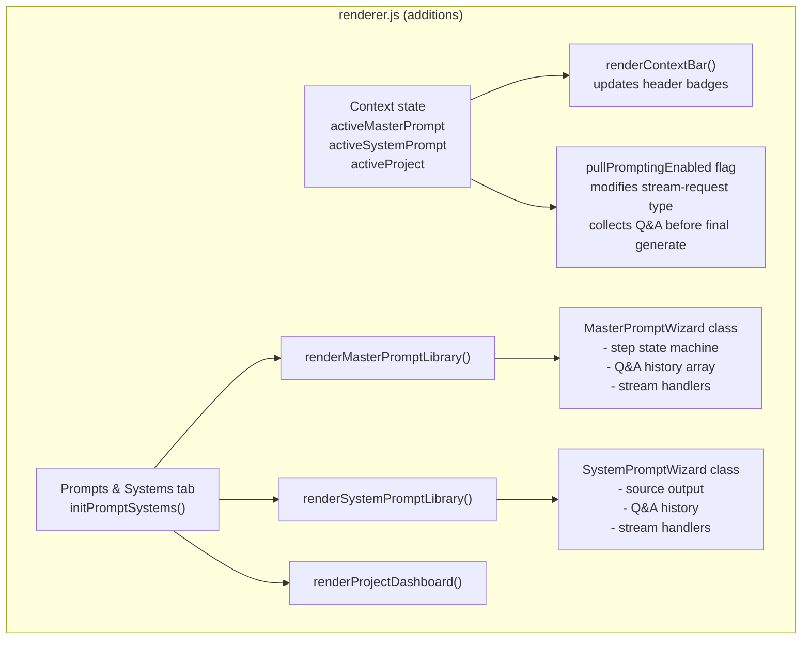

The existing `setupStreamListeners()` function must be extended to route the new `reqId` types (`masterPromptReqId`, `systemPromptReqId`, `pullInterviewReqId`) to their respective wizard handlers.

---

## 11. Implementation Phases

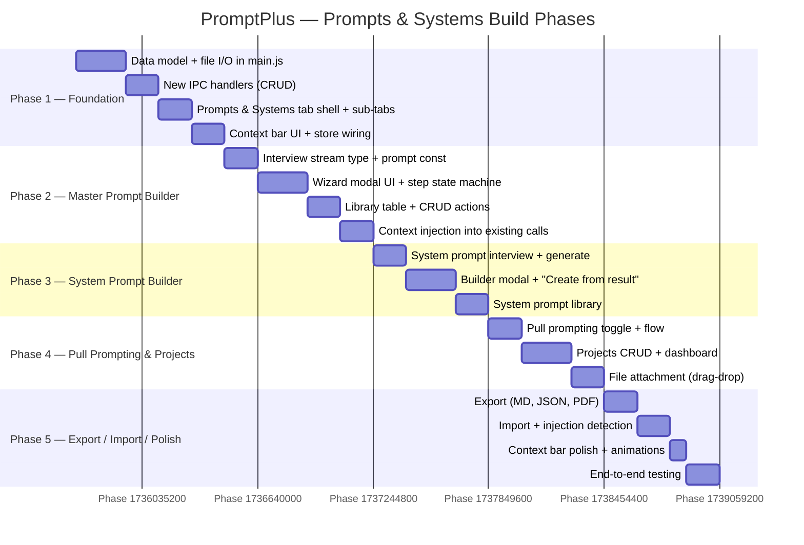

---

## 12. UI Component Inventory

### New components needed in `index.html` / `styles.css`

| Component | Description |
|-----------|-------------|
| `#context-bar` | Sticky bar under tab bar; shows active master/system/project badges |
| `#tab-prompts` | New tab content pane |
| `#ps-subnav` | Sub-tab buttons: Master Prompts / System Prompts / Projects |
| `#master-prompt-library` | Table with columns Name, Role, Updated, Actions |
| `#master-prompt-wizard` | Full-screen modal with step indicator, chat-style Q&A area, preview pane |
| `#system-prompt-library` | Table with columns Name, Category, Tags, Updated, Actions |
| `#system-prompt-wizard` | Modal with source output display + Q&A + preview |
| `#project-dashboard` | Card grid, each card shows project name, file count, last activity |
| `#project-detail` | Panel showing files, linked system prompts, launch button |
| `.pull-toggle` | Checkbox + label added to Generate/Analyze forms |
| `.context-badge` | Reusable pill component (name + ✕ clear button) |
| `#export-modal` | Format picker + filename input + download button |
| `#import-modal` | File picker + validation feedback |

---

## 13. Key Design Decisions

| Decision | Rationale |
|----------|-----------|
| **Local file storage** (not in-memory config) | Master prompts can grow large (multi-page documents). Separate `.json` files per record avoids bloating `promptplus-config.json` and allows easy manual editing/backup. |
| **Conversation history array in wizard** | Pull prompting requires sending the full Q&A transcript on each turn. The wizard maintains `messages[]` in renderer state and passes it as `input` to the stream handler. |
| **Context injected in main.js, not renderer** | The main process is the single source of truth for the active context. Injecting there ensures the hotkey enhancement path also benefits from loaded context — the renderer cannot reach the hotkey flow directly. |
| **PDF via Electron print-to-PDF** | No external dependency. `BrowserWindow.webContents.printToPDF()` can render any loaded HTML to PDF, matching the app's zero-runtime-dependency principle. A hidden off-screen window renders the document. |
| **Injection detection on import only** | Scanning every keystroke is wasteful. Injection patterns are checked once when a file is imported or when a master/system prompt is loaded into context, not during live editing. |
| **Extend existing `stream-request` channel** | Adding `type` values keeps IPC surface minimal. The renderer always sends one channel; routing by type is handled in the existing `ipcMain.on('stream-request')` switch. |
| **No multi-window** | The settings window is single-instance. Wizards open as modals within the existing window, consistent with the current model picker pattern. |
